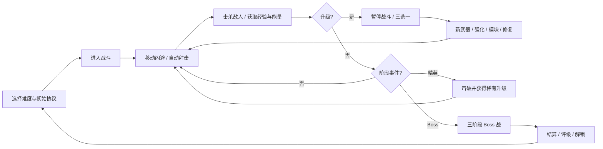
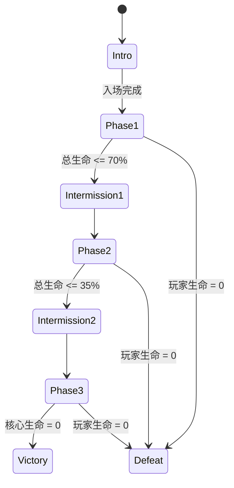
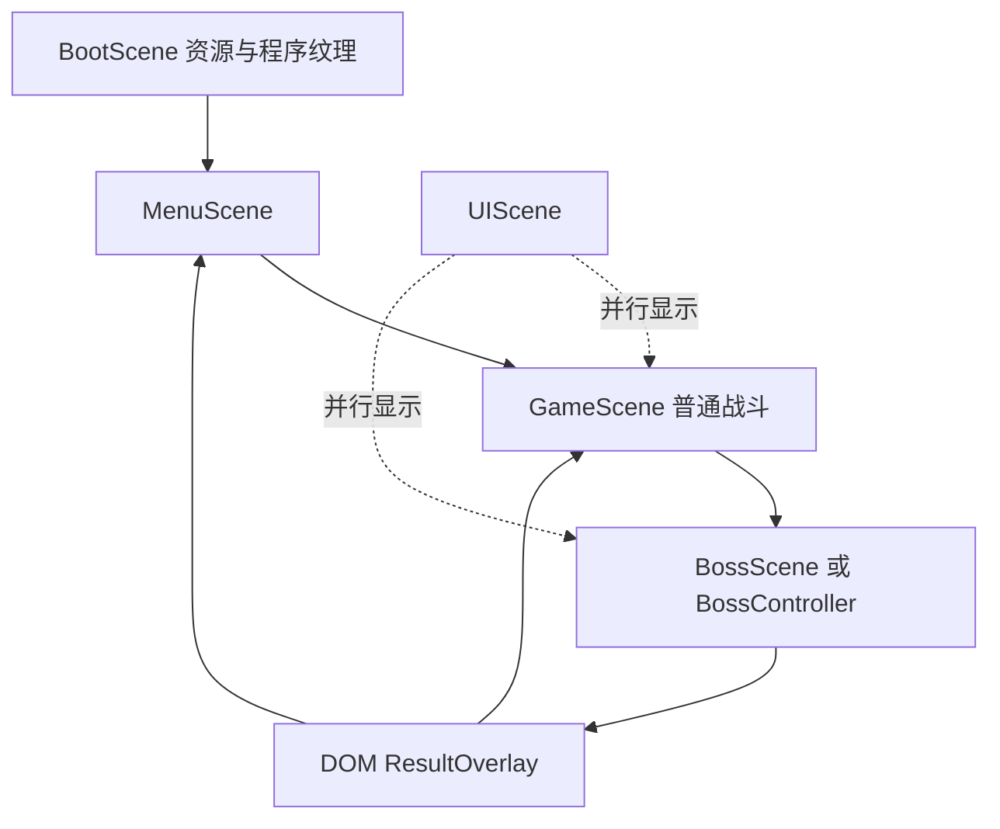

# 《奶龙打飞机》网页游戏

> 产品需求文档（PRD）+ 技术设计文档（TDD）  
> 文档版本：v0.1 草案  
> 面向角色：Solo Builder / AI Builder / 独立开发者  
> 首发平台：桌面浏览器，兼容手机竖屏  
> 文档日期：2026-08-24

---

## 0. 一页结论

### 0.1 产品一句话

《奶龙打飞机》是一款 **赛博科幻风、纵向卷轴、自动射击、局内 Roguelite 构筑** 的网页飞机大战：玩家扮演意外觉醒宇宙飞行能力的抽象奶龙，在约 10 分钟的一局中完成武器组合与进化，突破外太空敌阵并挑战拥有三个阶段的巨型机械 Boss，最终拯救世界。

### 0.2 首版必须带来的体验

1. 打开网页 3 秒内理解怎么玩，点击“启动作战”即可开局。
2. 前 20 秒就有明显爽感：自动射击、敌机爆炸、经验吸附、第一次升级三选一。
3. 每局都能形成不同流派，而不是单纯叠加攻击力。
4. 敌方弹幕“看起来密集，但有清晰安全区和预警”，失败原因可理解。
5. 第 8～10 分钟出现巨型 Boss，三阶段攻击逻辑和画面表现明显不同。
6. 视觉上像一套完整的科技终端，而不是一个孤零零的 Canvas。
7. 首版不依赖后端、账号、付费系统或复杂美术管线，solo builder 可以独立交付。

### 0.3 首版范围（P0）

| 模块 | P0 数量 / 目标 |
|---|---:|
| 完整关卡 | 1 个，约 10 分钟 |
| 模式 | 战役模式；通关后解锁无尽模式 |
| 玩家战机 | 1 架，3 项可选初始特性 |
| 主武器 | 6 种 |
| 被动模块 | 6 种 |
| 武器进化 | 4 组 |
| 普通敌人 | 6 种 |
| 精英敌人 | 2 种 |
| 巨型 Boss | 1 个，3 个阶段 |
| 主动技能 | 2 个，开局选择 1 个 |
| 难度 | 新兵 / 精英 / 噩梦 |
| 持久化 | 设置、最高分、解锁项、本地成长 |
| 语言 | 简体中文 |

### 0.4 明确不做（P0）

- 不做登录、排行榜服务器、联机 PvP、广告、支付、抽卡、每日任务。
- 不做开放世界、地图编辑器、剧情对话树、多角色养成。
- 不做 3D 模型和实时 3D 光照；使用高质量 2D、伪 3D、粒子和后处理风格。
- 不复制任何现有游戏的飞机造型、Boss、文案、音乐、关卡或数值。
- 不为了“玩法多”而同时做十几个半成品模式。

---

## 1. 市场玩法拆解与本作取舍

本节只提炼成熟玩法结构，不复制受版权保护的具体内容。

| 参考类型 | 已验证的体验点 | 本作吸收方式 | 本作不照搬的内容 |
|---|---|---|---|
| 《Sky Force Reloaded》类精品纵向射击 | 巨型 Boss、不同战机风格、任务目标和长期升级能增强重复游玩 | 清晰弹幕预警、巨型 Boss、局外小幅成长、关卡评级 | 关卡、美术、飞机造型、卡牌内容 |
| 《1945 Air Force》类移动端飞机大战 | 战机收集、升级、多模式、Boss 战和短时游玩 | 快速开局、成长反馈、战役/无尽两种节奏 | 真实历史飞机、付费养成、PvP、联盟 |
| 《Wing Fighter》类混合玩法 | 自动射击、Roguelite 三选一、战斗增益组合、无尽挑战 | 自动射击、局内升级、流派构筑、永久天赋的轻量版本 | 商业化循环、复杂装备槽、活动系统 |
| “Bullet Heaven / Survivors-like”类型 | 低输入门槛、自动攻击、升级选择、武器进化、逐渐形成压倒性 Build | 10 分钟一局、经验掉落、三选一、标签协同、进化 | 大地图自由移动、海量贴身怪物、30 分钟长局 |
| 传统弹幕射击 | 弹幕阅读、贴身擦弹、高风险高回报、Boss 阶段记忆 | 缩小玩家判定点、擦弹充能、预警线、安全通道 | 极端高难度、必须背板、满屏不可读特效 |

### 1.1 玩法定位

本作不是传统硬核弹幕游戏，也不是完全自动的“数值割草”。定位是：

> **70% 轻量动作闪避 + 20% Roguelite 构筑 + 10% 长期解锁。**

玩家的主要操作是移动和闪避；武器自动攻击。构筑决定输出方式，技术决定能否活下来，二者都必须重要。

### 1.2 核心差异点

1. **能量线路系统**：武器和模块带有“电磁 / 等离子 / 动能 / 量子”标签，组成两件套或三件套后改变武器行为，而不是只加百分比。
2. **擦弹过载**：敌弹从玩家判定核心附近掠过但未命中时积累过载值。满值后自动进入 5 秒“超频”，射速提升并回收附近经验。
3. **可破坏 Boss 部件**：优先击毁炮塔、翼刃或护盾发生器可改变后续阶段难度和掉落奖励。
4. **双层战场**：背景地面单位会用预警区攻击；玩家主战场仍是空中，保持实现成本可控。

---

## 2. 目标用户与体验指标

### 2.1 目标用户

- 喜欢飞机大战、弹幕射击，但不希望一上来就被高难度劝退的玩家。
- 喜欢局内三选一、Build 成型、数字和特效持续增长的玩家。
- 希望在浏览器中即开即玩，每次游玩 8～15 分钟的玩家。

### 2.2 体验指标（用于自测，不接线上统计）

| 指标 | 目标 |
|---|---:|
| 首次进入到可操作 | 小于 5 秒（本地/正常宽带） |
| 第一次升级 | 开局后 15～30 秒 |
| 单局时长 | 8～12 分钟 |
| 新兵难度首次 Boss 到达率 | 60%～80% |
| 新兵难度首次通关率 | 25%～45% |
| 精英难度通关率 | 10%～25% |
| 噩梦难度定位 | 通关后挑战，不保证首次可过 |
| 桌面端稳定帧率 | 主流设备 60 FPS，低配不低于 45 FPS |
| 移动端稳定帧率 | 中端设备目标 50～60 FPS |

---

## 3. 核心游戏循环



### 3.1 单局节奏

| 时间 | 内容 | 设计目的 |
|---:|---|---|
| 0:00～0:20 | 低压敌机、教学提示、首次经验掉落 | 让玩家立即理解移动与自动射击 |
| 0:20～2:00 | 基础编队、第一次升级、地面预警攻击 | 建立操作节奏 |
| 2:00 | 精英 1：护盾截击机 | 教玩家绕后或等待护盾窗口 |
| 2:00～4:30 | 敌人混编、第一次流派协同出现 | 形成 Build 方向 |
| 4:30 | 补给事件：三选一高品质奖励 | 中局喘息和决策 |
| 5:00 | 精英 2：分裂母机 | 测试清杂能力 |
| 5:00～8:00 | 弹幕密度提升、武器可进化 | 进入爽感高峰 |
| 8:00 | Boss 预警、10 秒清场与补给 | 给玩家准备时间 |
| 8:10～10:00 | 巨型 Boss，三个阶段 | 最终技术与 Build 检验 |
| 10:00+ | 结算；未击败则按伤害评级 | 避免失败完全无收获 |

### 3.2 操作方案

#### 桌面端

- 移动：`WASD` 或方向键。
- 精准模式：按住 `Shift`，移动速度降至 55%，显示玩家真实判定核心。
- 主动技能：`Space` 或鼠标右键。
- 暂停：`Esc` 或 `P`。
- 全屏：`F`，必须由用户点击/按键触发。
- 鼠标：按住左键或直接拖动飞机；此时保持自动射击。

#### 移动端

- 单指拖动飞机，采用“相对位移”，手指不需要压住飞机本体。
- 右下角一个半透明主动技能按钮。
- 暂停按钮位于右上角安全区。
- 禁止页面滚动、双击缩放和长按选择文本，仅限制游戏容器范围。

#### 操作原则

- 主武器始终自动射击，降低输入负担。
- 不使用“鼠标点击射击”，避免移动和开火争夺同一个输入。
- 切换到浏览器其他标签页时自动暂停。

---

## 4. 战斗系统

### 4.1 玩家基础属性

建议首版数值：

| 属性 | 初始值 | 说明 |
|---|---:|---|
| 最大生命 | 100 | 生命归零则失败 |
| 护盾 | 25 | 5 秒未受伤后缓慢恢复 |
| 移动速度 | 420 px/s | 逻辑分辨率下的桌面值 |
| 精准模式速度 | 231 px/s | 普通速度的 55% |
| 伤害倍率 | 1.0 | 所有玩家伤害的最终乘区之一 |
| 射速倍率 | 1.0 | 有全局上限，避免失控 |
| 暴击率 | 5% | 默认暴击伤害 150% |
| 吸附半径 | 90 px | 经验晶体进入后自动飞向玩家 |
| 核心判定半径 | 7 px | 飞机视觉尺寸大于真实判定点 |
| 擦弹半径 | 30 px | 只对未命中的敌方子弹生效一次 |

### 4.2 伤害公式

首版使用可读、可调的公式，不做复杂护甲穿透表。

```text
玩家对敌伤害 = 基础伤害 × 武器等级倍率 × (1 + 全局增伤) × 暴击倍率 × 难度修正

敌人对玩家伤害 = max(1, 敌方基础伤害 × 难度伤害倍率 - 玩家固定减伤)
```

约束：

- 全局射速倍率上限建议为 2.5。
- 暴击率上限 75%。
- 同一敌弹只能伤害玩家一次，命中后立即回收。
- 玩家受伤后获得 0.9 秒无敌时间；无敌期飞机闪烁但保持可见。
- Boss 碰撞伤害有独立 1.5 秒冷却，避免瞬间多次扣血。

### 4.3 擦弹与超频

- 敌弹进入擦弹圈且未进入核心判定圈时，增加 2 点过载值。
- 单颗敌弹只可触发一次擦弹，子弹对象记录 `hasGrazed`。
- 过载槽满值为 100。
- 满值自动触发 5 秒超频：射速 +35%、移动速度 +10%、经验吸附范围 +150%。
- 超频期间不再累计过载，结束后清零。
- 该机制必须有声音、环形 UI 和机体辉光反馈。

### 4.4 主动技能

开局选择一个，技能只负责“改变战况”，不成为常规输出主力。

| 技能 | 效果 | 冷却 |
|---|---|---:|
| 相位闪避 | 0.8 秒无敌，并向当前移动方向短距冲刺；清除路径附近小型敌弹 | 12 秒 |
| 电磁脉冲 | 清除屏幕内普通敌弹，对小型敌人造成眩晕，对 Boss 造成少量部件伤害 | 24 秒 |

### 4.5 掉落

| 掉落物 | 来源 | 效果 |
|---|---|---|
| 经验晶体 | 普通敌人 | 增加局内等级 |
| 大型经验核心 | 精英 / Boss 部件 | 大量经验 |
| 修复包 | 低概率或补给事件 | 回复 20 生命，不超过上限 |
| 临时护盾 | 特定编队 | 8 秒内获得 40 护盾 |
| 数据碎片 | 精英 / 结算 | 局外解锁货币 |

掉落物 12 秒未拾取后自动向玩家缓慢汇聚，避免长期堆积。

---

## 5. Roguelite 构筑系统

### 5.1 升级规则

- 玩家获取足够经验后升级，游戏世界暂停，显示 3 张升级卡。
- 首次升级保证至少出现 1 个新武器。
- 已有 4 个武器后，不再出现新武器，只出现已有武器升级、模块或恢复项。
- 每次升级允许 1 次免费刷新；之后本局不再免费刷新。
- 稀有度：普通 70%、稀有 25%、原型 5%。稀有度改变数值，不改变基础规则。
- 升级卡必须显示“当前值 → 新值”，避免模糊文案。

### 5.2 主武器（6 种）

| ID | 名称 | 标签 | 基础行为 | 满级变化 |
|---|---|---|---|---|
| `pulse_cannon` | 脉冲机炮 | 动能 | 朝前方高速连射，稳定单体输出 | 每第 8 发变为穿透弹 |
| `plasma_fan` | 等离子扇流 | 等离子 | 前方扇形多发，适合清杂 | 外侧弹道向中心轻微追踪 |
| `rail_lance` | 磁轨长枪 | 电磁 / 动能 | 低射速直线穿透，伤害高 | 命中 3 个目标后触发回波射线 |
| `seeker_swarm` | 寻迹蜂群 | 量子 | 周期发射导弹，自动追踪高威胁目标 | 导弹分裂成两枚微型弹头 |
| `arc_drone` | 电弧僚机 | 电磁 | 两架僚机攻击最近敌人，电弧可跳跃 | 增至三架并提高跳跃次数 |
| `void_orbit` | 虚空环刃 | 量子 | 环绕玩家旋转，可消除少量普通弹 | 环刃周期向外扩张后回收 |

### 5.3 被动模块（6 种）

| ID | 名称 | 标签 | 效果方向 |
|---|---|---|---|
| `reactor` | 聚变反应堆 | 等离子 | 增伤、略微增加受到的护盾伤害 |
| `capacitor` | 超导电容 | 电磁 | 射速、技能冷却 |
| `targeting_ai` | 预测瞄准阵列 | 量子 | 暴击率、追踪转向速度 |
| `nano_armor` | 纳米装甲 | 动能 | 最大生命、固定减伤 |
| `magnet_core` | 引力核心 | 量子 | 吸附半径、掉落移动速度 |
| `afterburner` | 矢量推进器 | 动能 | 移速、精准模式控制 |

### 5.4 武器进化（首版 4 组）

当武器达到 5 级，且持有指定模块至少 2 级时，下次精英奖励可进化。

| 武器 + 模块 | 进化名称 | 行为变化 |
|---|---|---|
| 脉冲机炮 + 纳米装甲 | 堡垒连锁炮 | 连射形成热量；停火窗口自动释放贯穿弹幕 |
| 等离子扇流 + 聚变反应堆 | 日冕喷流 | 扇形合并为持续热浪，近距离伤害更高 |
| 磁轨长枪 + 超导电容 | 雷霆脊柱 | 贯穿线留下短暂电场，对 Boss 部件额外有效 |
| 寻迹蜂群 + 预测瞄准阵列 | 奇点蜂群 | 导弹命中后形成小型吸附奇点，聚拢普通敌人 |

### 5.5 标签协同

同一标签达到 2 个和 3 个时激活协同。标签只计算当前装备，不计算临时效果。

示例：

- 电磁 2 件：对护盾和 Boss 部件伤害 +15%。
- 电磁 3 件：连续命中同一目标会叠加“导电”，满 5 层触发链状闪电。
- 量子 2 件：追踪弹和环绕物持续时间 +20%。
- 量子 3 件：每 12 秒复制下一次主动技能的 40% 效果。
- 动能 2 件：穿透 +1。
- 等离子 2 件：命中附加短时灼烧，但同一目标的灼烧层数有上限。

### 5.6 三选一生成伪代码

```ts
function rollUpgradeChoices(run: RunState, rng: SeededRng): UpgradeChoice[] {
  const pool = buildEligiblePool(run);
  const choices: UpgradeChoice[] = [];

  if (run.level === 1) {
    choices.push(rng.pick(pool.filter(isNewWeapon)));
  }

  while (choices.length < 3) {
    const candidate = weightedPick(pool, rarityWeights, rng);
    if (!choices.some(item => item.id === candidate.id)) {
      choices.push(candidate);
    }
  }

  return choices;
}
```

必须使用带种子的随机数。结算页记录 seed，便于复现 Bug。

---

## 6. 敌人与波次设计

### 6.1 普通敌人

| ID | 名称 | 行为 | 玩家应对 |
|---|---|---|---|
| `scout` | 蜂针侦察机 | 直线飞入，少量点射 | 基础练习 |
| `weaver` | 编织者 | 正弦移动，发射三连弹 | 预判路径 |
| `kamikaze` | 裂变突击机 | 锁定后冲撞，显示红色路径 | 快速横移 |
| `turret` | 浮空炮台 | 停驻后发射扇形弹 | 优先击杀或穿过扇形缺口 |
| `carrier` | 孵化母机 | 缓慢移动并生成侦察机 | 输出优先级判断 |
| `shielder` | 镜盾机 | 正面减伤，周期旋转露出核心 | 绕位或等待窗口 |

### 6.2 精英敌人

| 名称 | 机制 | 奖励 |
|---|---|---|
| 棱镜截击者 | 旋转护盾反射部分正面子弹；冲刺前显示路径 | 稀有三选一 + 大经验核心 |
| 双生母巢 | 生命降至 50% 时分裂为两架，必须在短时间内连续击破 | 稀有三选一 + 数据碎片 |

### 6.3 波次格式

波次由配置驱动，不把时间线硬编码在 Scene 中。

```ts
interface WaveConfig {
  id: string;
  startMs: number;
  durationMs: number;
  formations: FormationConfig[];
  intensity: number;
  musicCue?: string;
}

interface FormationConfig {
  enemyId: EnemyId;
  count: number;
  spawnPattern: 'line' | 'v' | 'arc' | 'randomEdge' | 'paired';
  movementPath: 'straight' | 'sine' | 'bezierDive' | 'stopAndFire';
  intervalMs: number;
  params?: Record<string, number>;
}
```

### 6.4 难度不是单纯加血

| 难度 | 敌方生命 | 敌方伤害 | 弹速 | 额外规则 |
|---|---:|---:|---:|---|
| 新兵 | 0.85× | 0.8× | 0.9× | 预警时间更长，Boss 阶段间掉落修复包 |
| 精英 | 1.0× | 1.0× | 1.0× | 标准规则 |
| 噩梦 | 1.15× | 1.25× | 1.12× | 编队更复杂，Boss 招式组合更快 |

生命倍率不要超过 1.2，以免敌人变成“血牛”。高难度主要改变弹幕组合、预警时间和敌人协作。

---

## 7. 巨型 Boss 设计

### 7.1 Boss 概念

名称：**“天穹吞噬者 Ω / OMEGA LEVIATHAN”**  
视觉：机械蝠鲼与空中航母的结合体，宽度占游戏区域的 75%～90%；深色装甲、青色能源脉络、警戒状态转为洋红和橙红。  
结构：主体核心、左右翼刃、两座电磁炮塔、腹部护盾发生器，共 6 个可命中部件。

### 7.2 Boss 状态机



### 7.3 第一阶段：封锁（100%～70%）

- Boss 在屏幕上方左右缓慢移动。
- 左右翼炮塔交替发射五向扇形弹，中间留出可读缺口。
- 地面出现两条纵向激光预警，0.9 秒后生效。
- 护盾发生器周期启动：主体减伤 60%，玩家需要攻击外露炮塔。
- 教学目的：理解部件优先级和激光预警。

### 7.4 第二阶段：猎杀（70%～35%）

- Boss 翼刃展开，移动幅度增大。
- 翼刃发射旋转弹幕，但每圈固定有一个 35° 安全扇区。
- 主体锁定玩家当前位置，显示线框，1.1 秒后俯冲扫过。
- 若第一阶段提前破坏某侧炮塔，该侧旋转弹幕密度降低。
- 阶段结束时清除现存敌弹，给 1.5 秒喘息。

### 7.5 第三阶段：核心过载（35%～0%）

- 装甲脱落、核心暴露、背景变暗，音乐进入高强度段落。
- 交替使用“收缩圆环弹幕”和“棋盘式激光”。
- 圆环弹幕永远留至少一条从玩家当前位置可到达的通路。
- 棋盘激光分两次点亮，玩家必须在第一次爆发后换区。
- 每 18 秒进入 4 秒充能：Boss 停止移动，核心受到 150% 伤害。
- 生命低于 10% 后只加快招式间隔，不增加弹速，保持可读性。

### 7.6 部件破坏反馈

- 部件生命归零时：局部白闪 80ms、爆炸粒子、镜头轻震、对应武器停止工作。
- Boss 主血条下方显示 4 个关键部件图标。
- 击毁全部关键部件可获得 `SYSTEM BREAK` 评级加分。
- 特效不能遮住新生成的弹幕；爆炸粒子渲染层必须低于敌弹层。

### 7.7 Boss 公平性规则

1. 致命激光必须先有颜色、形状和声音三重预警，预警不少于 700ms。
2. 不在玩家当前不可逃离的位置瞬间生成碰撞体。
3. 阶段切换时回收全部敌弹。
4. Boss 入场动画期间玩家可移动，但 Boss 不造成碰撞伤害。
5. 同时生效的“高优先级威胁”不超过 2 种。

---

## 8. 模式与局外成长

### 8.1 战役模式（P0 默认）

- 固定 10 分钟时间线，包含教学、两次精英和最终 Boss。
- 三档难度。
- 结算评级：`S / A / B / C`。
- 评级由通关、剩余生命、Boss 部件破坏、擦弹数和用时组成。

```text
总分 = 击杀分 + Boss伤害分 + 擦弹分 + 部件破坏分 + 通关奖励
评级参考：S >= 120000，A >= 90000，B >= 60000，否则 C
```

### 8.2 无尽模式（P0 通关解锁）

- 使用战役前 8 分钟的波次池动态组合。
- 每 3 分钟提升一级威胁度，每 6 分钟出现一次精英。
- 12 分钟后 Boss 以削弱版部件形态重复出现，后续逐渐提速。
- 只保存最高存活时间和最高分。
- 无尽模式不新增独占系统，只复用现有内容。

### 8.3 局外成长

数据碎片用于解锁“协议”，每项只带来小幅优势或改变开局风格，避免必须刷数值。

| 协议 | 效果 | 解锁条件 |
|---|---|---|
| 均衡协议 | 默认，无额外效果 | 初始 |
| 先锋协议 | 初始移速 +8%，最大护盾 -10 | 完成任意一局 |
| 工程协议 | 僚机类伤害 +12%，主炮伤害 -5% | 击毁 20 个 Boss 部件 |
| 赌徒协议 | 原型升级概率 +3%，最大生命 -15 | 精英难度 A 评级 |

局外成长上限控制在约 15% 战力差距，确保操作与 Build 仍是胜负关键。

---

## 9. 页面信息架构与 UI

### 9.1 页面结构

#### 桌面端（宽度 ≥ 1024px）

```text
┌──────────────────────────────────────────────────────────┐
│ LOGO / 在线状态                  声音  设置  全屏         │
├──────────────┬────────────────────────┬──────────────────┤
│ 作战数据     │                        │ 当前构筑         │
│ 分数/连击    │     竖向游戏画面       │ 武器与模块       │
│ 生命/护盾    │      405 × 720         │ 标签协同         │
│ 过载环       │                        │ 技能冷却         │
├──────────────┴────────────────────────┴──────────────────┤
│ 控制提示 / 版本 / 本地存档状态                            │
└──────────────────────────────────────────────────────────┘
```

- 游戏逻辑分辨率为 `720 × 1280`，显示为约 `405 × 720`。
- 外层网页最大宽度约 `1180px`，高度适配 `100dvh`。
- 左右信息面板在战斗时展示数据；菜单时用于世界观和模式介绍。

#### 平板与手机

- 游戏画布充满安全可用区域，保持 9:16。
- 两侧面板折叠为画布内 HUD。
- 升级三选一在窄屏改为纵向卡片堆叠，保证每张卡可读。
- 使用 `env(safe-area-inset-*)` 处理刘海与底部手势区。

### 9.2 页面状态

1. 首次加载页：Logo、加载进度、提示“点击以启用音频”。
2. 主菜单：启动作战、无尽模式、机库协议、设置。
3. 模式/难度选择：显示预计时长和难度差异。
4. 战斗 HUD。
5. 升级三选一浮层。
6. 暂停与设置浮层。
7. 结算页：评级、Build、关键数据、重开按钮。

### 9.3 升级卡信息层级

每张卡按以下顺序显示：

1. 稀有度与类型。
2. 图标 + 名称 + 当前等级。
3. 一句话行为描述。
4. 明确数值：`伤害 18 → 23`、`弹体 3 → 4`。
5. 标签与协同提示。
6. 若满足进化条件，显示醒目的“可进化”标志。

### 9.4 HUD 规则

- 生命、护盾和 Boss 血条必须在快速扫视中可区分，不只依赖颜色。
- 敌弹使用暖色（橙红 / 洋红），玩家子弹使用冷色（青 / 蓝 / 紫）。
- Boss 激光预警使用带斜线纹理的半透明区域。
- 连击信息只在重要节点放大，不能持续遮挡视野。
- 战斗数字默认合并显示：同一目标 120ms 内的连续伤害聚合，避免数字雨。

---

## 10. 视觉与动效规范

### 10.1 视觉关键词

`深空`、`全息 HUD`、`霓虹能源`、`玻璃面板`、`军用终端`、`高对比弹幕`、`克制的故障艺术`。

### 10.2 色彩 Token

```css
:root {
  --bg-void: #050712;
  --bg-panel: rgba(10, 18, 38, 0.78);
  --line-dim: rgba(114, 234, 255, 0.18);
  --cyan: #63f3ff;
  --blue: #4a7dff;
  --violet: #a56cff;
  --magenta: #ff4fd8;
  --warning: #ffb84a;
  --danger: #ff4f67;
  --success: #77ffb2;
  --text-main: #e9f7ff;
  --text-muted: #8da6bd;
}
```

使用原则：青色表示玩家和可交互项；橙红表示危险；紫色表示稀有或量子能量。不要让所有元素都发光。

### 10.3 字体

- 中文：优先系统字体 `"Microsoft YaHei", "PingFang SC", sans-serif`，避免首版加载大型中文 Web Font。
- 数字和英文标题：可使用项目内已授权的可变字体；若没有则回退 `"Arial Narrow", sans-serif`。
- 数字使用等宽或 tabular numbers，减少 HUD 跳动。

### 10.4 背景层

游戏背景使用 4 层视差：

1. 深色渐变与星云噪点。
2. 慢速远景星点。
3. 中速城市/轨道结构剪影。
4. 快速网格、云雾或碎片。

背景亮度始终低于战斗对象。进入 Boss 第三阶段时降低背景饱和度，使核心和弹幕更清晰。

### 10.5 动效规则

- 按钮 Hover：120～180ms；面板进入：220～320ms。
- 爆炸：白色核心闪光 → 主色冲击环 → 暗色碎片，总时长 350～600ms。
- 屏幕震动：普通击杀不震；精英破坏 3px/120ms；Boss 部件 6px/180ms；最终击杀 10px/350ms。
- 命中停顿只用于 Boss 部件和最终击杀，时长 40～80ms。
- 提供“减少闪烁”和“关闭屏幕震动”设置。

### 10.6 首版资产策略

优先用代码生成的矢量几何、渐变、粒子和简单程序纹理完成可玩版本：

- 战机与敌机：由三角形、梯形、圆角矩形和发光描边组合。
- Boss：拆成独立部件，便于部件破坏与换色。
- 子弹：小型几何图形 + 尾迹，不用大贴图。
- 图标：统一线性 SVG，必须确认许可或自行绘制。
- 音频：使用自制、生成或明确可商用素材，保留来源与许可文件。

这样 Builder 不会因为缺少美术文件而无法交付。后续可逐步替换为正式 Sprite，不改变玩法代码。

---

## 11. 音频规范

### 11.1 音频层级

- BGM：菜单、战斗、Boss 三段；Boss 第三阶段可切换到高强度 Stem。
- 高频 SFX：玩家开火、命中。必须限制并发和音量，不能每颗子弹播放一次声音。
- 重要 SFX：升级、技能、护盾破裂、Boss 部件破坏、低生命警报。
- UI SFX：Hover、确认、返回，音量比战斗音效低。

### 11.2 实现约束

- 浏览器禁止未交互自动播放；首次点击“启动系统”后再恢复音频上下文。
- 同类命中音效设置 50～100ms 节流，并随机轻微改变音高。
- 页面失焦自动暂停 BGM 和游戏逻辑。
- 音乐、音效、震动分别可调；设置写入本地存储。

---

## 12. 技术选型

### 12.1 推荐栈

| 层 | 选择 | 原因 |
|---|---|---|
| 构建 | Vite + TypeScript | 启动快、静态部署简单、类型约束适合配置驱动 |
| 游戏框架 | Phaser `3.90.0` | 2D Scene、输入、音频、Arcade Physics、Tween、对象池生态成熟 |
| 页面 UI | 原生 HTML + CSS + 少量 TypeScript | 不引入 React，降低 bundle 和状态同步复杂度 |
| 游戏渲染 | Phaser WebGL，Canvas 自动回退 | 粒子和批处理表现好 |
| 碰撞 | Phaser Arcade Physics + 自定义圆形命中检测 | 飞机大战不需要复杂刚体模拟 |
| 存档 | `localStorage`，带 schema 版本 | 首版无后端即可持久化 |
| 测试 | Vitest + Playwright（可选但推荐） | 逻辑单测和关键流程浏览器测试 |
| 部署 | 任意静态托管 | 产物仅为 HTML/CSS/JS/资源文件 |

### 12.2 为什么首版固定 Phaser 3.90.0

Phaser 新主版本的 API 与生态可能变化。首版固定到成熟的 3.90.0，Builder 不要混用 Phaser 4 文档或代码片段。升级框架必须单独开分支并完成回归测试。

### 12.3 逻辑分辨率

```ts
const GAME_WIDTH = 720;
const GAME_HEIGHT = 1280;

const config: Phaser.Types.Core.GameConfig = {
  type: Phaser.AUTO,
  width: GAME_WIDTH,
  height: GAME_HEIGHT,
  parent: 'game-root',
  backgroundColor: '#050712',
  scale: {
    mode: Phaser.Scale.FIT,
    autoCenter: Phaser.Scale.CENTER_BOTH,
  },
  physics: {
    default: 'arcade',
    arcade: { gravity: { x: 0, y: 0 }, debug: false },
  },
};
```

Canvas 只负责游戏世界和紧贴战斗的 HUD；主菜单、设置、外部信息面板可用 DOM。升级三选一建议使用 DOM Overlay，方便响应式和可访问性。

---

## 13. 工程结构

```text
neon-strike/
├─ public/
│  ├─ assets/
│  │  ├─ audio/
│  │  ├─ images/
│  │  └─ fonts/
│  └─ favicon.svg
├─ src/
│  ├─ main.ts
│  ├─ style.css
│  ├─ game/
│  │  ├─ config.ts
│  │  ├─ constants.ts
│  │  ├─ events.ts
│  │  ├─ scenes/
│  │  │  ├─ BootScene.ts
│  │  │  ├─ MenuScene.ts
│  │  │  ├─ GameScene.ts
│  │  │  ├─ BossScene.ts
│  │  │  └─ UIScene.ts
│  │  ├─ entities/
│  │  │  ├─ Player.ts
│  │  │  ├─ Enemy.ts
│  │  │  ├─ Boss.ts
│  │  │  ├─ Projectile.ts
│  │  │  └─ Pickup.ts
│  │  ├─ systems/
│  │  │  ├─ CombatSystem.ts
│  │  │  ├─ SpawnSystem.ts
│  │  │  ├─ UpgradeSystem.ts
│  │  │  ├─ WeaponSystem.ts
│  │  │  ├─ DropSystem.ts
│  │  │  ├─ GrazeSystem.ts
│  │  │  ├─ DifficultySystem.ts
│  │  │  ├─ SaveSystem.ts
│  │  │  └─ AudioSystem.ts
│  │  ├─ weapons/
│  │  ├─ patterns/
│  │  └─ data/
│  │     ├─ weapons.ts
│  │     ├─ modules.ts
│  │     ├─ enemies.ts
│  │     ├─ waves.ts
│  │     └─ boss.ts
│  ├─ ui/
│  │  ├─ AppShell.ts
│  │  ├─ UpgradeOverlay.ts
│  │  ├─ SettingsOverlay.ts
│  │  └─ ResultOverlay.ts
│  ├─ core/
│  │  ├─ EventBus.ts
│  │  ├─ SeededRng.ts
│  │  ├─ ObjectPool.ts
│  │  └─ math.ts
│  └─ types/
│     └─ game.ts
├─ tests/
│  ├─ upgrade-system.test.ts
│  ├─ damage.test.ts
│  └─ save-migration.test.ts
├─ index.html
├─ package.json
├─ tsconfig.json
└─ vite.config.ts
```

### 13.1 模块职责

- `Scene`：生命周期、镜头、显示层和系统装配，不承载大量规则。
- `Entity`：保存单个对象状态和最小行为。
- `System`：处理一类规则，如伤害、升级、生成、掉落。
- `data`：纯配置，不引用 Scene。
- `EventBus`：连接 Phaser 世界与 DOM UI。
- `SaveSystem`：唯一可以直接读写 `localStorage` 的模块。

禁止把所有功能写进 `GameScene.ts`。该文件建议控制在 400 行以内。

---

## 14. Scene 与状态流



实现建议：Boss 若需要复用同一战斗世界，可作为 `BossController` 留在 `GameScene` 中；不要为了形式强制切 Scene。`UIScene` 与游戏 Scene 并行，DOM Overlay 只处理升级、暂停、设置和结算。

### 14.1 游戏主状态

```ts
type GamePhase =
  | 'loading'
  | 'menu'
  | 'playing'
  | 'choosing-upgrade'
  | 'paused'
  | 'boss-intro'
  | 'boss-fight'
  | 'victory'
  | 'defeat';
```

任意时刻只能有一个主状态。暂停和升级时必须同时停止：敌人更新、弹幕、波次计时、技能冷却和玩家移动。

---

## 15. 数据模型

### 15.1 运行时状态

```ts
interface RunState {
  seed: string;
  mode: 'campaign' | 'endless';
  difficulty: 'rookie' | 'elite' | 'nightmare';
  elapsedMs: number;
  level: number;
  xp: number;
  xpToNext: number;
  score: number;
  combo: number;
  kills: number;
  grazes: number;
  rerollsRemaining: number;
  activeSkillId: string;
  weapons: OwnedUpgrade[];
  modules: OwnedUpgrade[];
  activeSynergies: string[];
  bossPartsDestroyed: string[];
}

interface OwnedUpgrade {
  id: string;
  level: number;
  evolvedId?: string;
}
```

### 15.2 存档

```ts
interface SaveDataV1 {
  schemaVersion: 1;
  settings: {
    masterVolume: number;
    musicVolume: number;
    sfxVolume: number;
    screenShake: boolean;
    reducedFlashes: boolean;
    damageNumbers: boolean;
    controlMode: 'auto' | 'keyboard' | 'pointer';
  };
  progression: {
    dataFragments: number;
    unlockedProtocols: string[];
    endlessUnlocked: boolean;
  };
  records: {
    bestCampaignScore: number;
    bestEndlessScore: number;
    bestEndlessTimeMs: number;
    highestRankByDifficulty: Record<string, string>;
  };
}
```

存储键：`neon-strike:save:v1`。读取失败或 JSON 损坏时保留原字符串到 `neon-strike:save:recovery`，再创建新存档。设置页提供“清除本地数据”，并二次确认。

### 15.3 事件总线

建议事件：

```ts
type GameEventMap = {
  'run:started': { seed: string; mode: string; difficulty: string };
  'hud:updated': HudSnapshot;
  'upgrade:requested': { choices: UpgradeChoice[] };
  'upgrade:selected': { choiceId: string };
  'boss:phase-changed': { phase: 1 | 2 | 3 };
  'run:ended': RunResult;
  'audio:unlock-requested': undefined;
};
```

不要每帧向 DOM 发送完整状态。HUD 数值可每 100ms 批量同步一次，重要事件立即发送。

---

## 16. 渲染层与碰撞层

### 16.1 显示层级（从下到上）

1. 远景背景。
2. 近景背景 / 地面预警。
3. 掉落物。
4. 敌人和 Boss。
5. 玩家子弹。
6. 玩家飞机。
7. 敌方子弹。
8. 关键预警线和判定核心。
9. 游戏内 HUD。
10. 暂停 / 升级 DOM Overlay。

普通爆炸粒子放在敌方子弹下方，危险预警永远不能被特效遮挡。

### 16.2 碰撞矩阵

| A | B | 结果 |
|---|---|---|
| 玩家子弹 | 敌人 / Boss 部件 | 计算伤害，按穿透次数决定是否回收 |
| 敌方子弹 | 玩家核心 | 扣护盾/生命，进入无敌时间 |
| 敌方子弹 | 玩家擦弹圈 | 增加过载，不回收子弹 |
| 玩家 | 敌人 / Boss | 碰撞伤害，有独立冷却 |
| 玩家 | 掉落物 | 拾取 |
| 特定环刃 / EMP | 普通敌弹 | 回收敌弹 |

Boss 大型外观不能使用一个巨大矩形碰撞体；必须按可破坏部件拆分圆形或小矩形碰撞区。

---

## 17. 性能预算

### 17.1 目标预算

| 项目 | 上限 / 目标 |
|---|---:|
| 同屏敌方子弹 | 700；低画质 450 |
| 同屏玩家子弹 | 350 |
| 同屏普通敌人 | 80 |
| 同屏粒子 | 500；低画质 250 |
| 活跃掉落物 | 120 |
| Draw Calls | 尽量少于 120 |
| 首次资源体积 | 建议小于 8 MB |
| 单帧脚本时间 | 60 FPS 下尽量小于 8 ms |

### 17.2 必须执行的优化

- 子弹、敌人、掉落物、爆炸粒子全部对象池化，禁止高频 `new/destroy`。
- 离开屏幕安全边界的对象立即回收。
- 追踪弹不必每帧重新搜索全场目标；每 100～200ms 更新一次目标。
- 大量距离判断使用平方距离，避免不必要的平方根。
- 子弹纹理预生成并复用，不在 `update()` 中创建 Graphics 或纹理。
- 伤害数字合并，限制同屏数量。
- 低画质关闭部分尾迹、扭曲、远景粒子，不改变碰撞和弹幕逻辑。
- `delta` 参与移动和计时；对异常大 `delta` 做上限保护。

### 17.3 降级策略

连续 3 秒低于 45 FPS 时可提示玩家切换低画质，但不要在战斗中自动切换并造成画面跳变。移动端默认中等粒子密度。

---

## 18. 可访问性与可用性

- 所有菜单可用键盘 Tab、Enter、Escape 操作，焦点态清晰。
- 颜色不是唯一信息通道；危险区域增加纹理、轮廓和动画方向。
- 提供屏幕震动、闪烁、伤害数字、音乐和音效开关。
- “减少闪烁”开启后，不使用快速全屏白闪；改为局部轮廓和短时慢动作。
- 字号：移动端主正文不小于 14px，重要按钮不小于 16px。
- 触控目标建议至少 44×44 CSS px。
- 暂停时明确显示控制方式、当前 Build 和重新开始按钮。
- 游戏失败页默认聚焦“再次出击”，但不得自动开始。

---

## 19. 测试策略

### 19.1 单元测试

优先测试纯逻辑：

1. 伤害公式、暴击上限、无敌时间。
2. 升级池过滤：武器槽满后不再出现新武器。
3. 同一次三选一不重复。
4. 进化条件判断。
5. 带种子随机数在相同 seed 下结果一致。
6. 存档读取、损坏恢复和版本迁移。
7. 难度倍率不影响 UI 原始配置。

### 19.2 集成测试

- 开局 → 第一次升级 → 选择武器 → 恢复战斗。
- 暂停后所有计时器停止，恢复后无跳帧式补算。
- 切标签页自动暂停。
- Boss 阶段切换回收所有敌弹。
- Boss 部件破坏后对应攻击停止。
- 通关解锁无尽模式并正确保存。
- 清除本地数据后恢复默认设置。

### 19.3 手工设备矩阵

| 平台 | 浏览器 | 必测项 |
|---|---|---|
| Windows | Chrome / Edge 最新稳定版 | 键鼠、全屏、60 FPS、声音恢复 |
| macOS | Safari / Chrome 最新稳定版 | 键盘映射、音频策略、缩放 |
| iPhone | Safari | 触控、安全区、页面不滚动、音频解锁 |
| Android | Chrome | 触控延迟、方向变化、性能降级 |

### 19.4 数值调试工具

开发环境提供 `?debug=1`：

- 显示 FPS、对象池使用量、敌弹数、当前波次、seed。
- 可跳转到时间点：2:00、5:00、8:00、Boss Phase 2/3。
- 玩家无敌、伤害倍率滑杆、立即升级按钮。
- 可视化碰撞圈与擦弹圈。

生产构建不显示入口，但保留通过 query 参数启用的能力也可；不得保存调试作弊结果到正式纪录。

---

## 20. P0 验收标准

只有以下项目全部满足，才算首版完成：

### 20.1 可玩性

- [ ] 玩家可用键盘、鼠标和触控移动。
- [ ] 自动射击、敌人生成、命中、伤害、死亡、掉落和拾取形成完整循环。
- [ ] 至少 6 种武器、6 种模块可通过三选一获得和升级。
- [ ] 至少 4 个进化组合可实际触发，行为变化肉眼可见。
- [ ] 有擦弹、过载和至少 1 个主动技能。
- [ ] 一局包含 6 种普通敌人、2 种精英和波次混编。
- [ ] Boss 有三个阶段、可破坏部件、至少 5 种攻击模式。
- [ ] 战役可胜利也可失败，均能进入结算并重新开始。
- [ ] 通关后无尽模式解锁且可进入。

### 20.2 视觉与反馈

- [ ] 主菜单、战斗、升级、暂停、Boss、结算状态视觉统一。
- [ ] 科技风外层页面、响应式布局和 9:16 游戏区域完整。
- [ ] 玩家弹、敌弹、掉落和危险预警可快速区分。
- [ ] 升级、受伤、护盾破裂、Boss 部件破坏有明确的视听反馈。
- [ ] Boss 第三阶段在音乐、色彩、动作和弹幕上均明显升级。

### 20.3 技术质量

- [ ] `npm run build` 成功，无 TypeScript 错误。
- [ ] 无阻断级 Console Error，无资源 404。
- [ ] 对象池回收正常，连续游玩 20 分钟对象数量不持续增长。
- [ ] 页面失焦自动暂停，恢复后时间线正确。
- [ ] 设置与解锁项刷新页面后仍存在。
- [ ] 桌面 60 FPS 目标和移动端降级策略通过手测。
- [ ] 未经许可的图片、音乐、字体和代码不进入项目。

---

## 21. Builder 实施顺序

不要一次性让 Builder 生成全部内容。按以下阶段构建，每阶段都必须可运行。

### 阶段 1：灰盒战斗（最小闭环）

- Vite + TypeScript + Phaser 工程。
- 720×1280 逻辑画面与响应式外壳。
- 玩家移动、自动射击、1 种敌人、对象池、碰撞、生命和失败。
- 全部使用几何占位图。

完成条件：能连续玩 2 分钟，无明显内存增长。

### 阶段 2：波次与升级

- 经验、等级、三选一 Overlay。
- 先做 3 种武器、3 种模块。
- 配置驱动波次、2 种敌人、1 个精英。
- 带种子 RNG 和调试面板。

完成条件：相同 seed 的前 3 次升级选项一致。

### 阶段 3：完整内容

- 扩充到 6 种武器、6 种模块、4 个进化、6+2 种敌人。
- 完成 8 分钟普通关卡节奏。
- 加入主动技能、擦弹和过载。

完成条件：至少三种明显不同的通关 Build 可用。

### 阶段 4：Boss

- 先实现状态机和简化弹幕，再补部件与特效。
- 给每种攻击独立 pattern 类和可视化预警。
- 加入阶段切换清弹与调试跳转。

完成条件：新兵难度下，纯基础武器也能通过正确走位撑过 Boss 90 秒。

### 阶段 5：视觉、音频与页面

- 程序纹理、粒子、视差背景、网页外壳、科技 UI。
- 音频解锁、BGM、SFX 节流。
- 完成响应式、设置和可访问性。

### 阶段 6：存档、无尽与 QA

- 结算、评级、协议解锁、无尽模式。
- 性能测试、移动端测试、存档迁移测试。
- 修复阻断问题后再增加内容。

---

## 22. 给 Builder 的最终执行指令模板

下面这段可在文档确认后，作为下一轮发给 Builder 的基础提示词。正式使用前应把仍待确认的选项补齐。

```text
请根据随附的《裂空协议：NEON STRIKE》PRD/TDD 实现一个可运行的网页飞机大战。

技术约束：
1. 使用 Vite + TypeScript + Phaser 3.90.0；页面 UI 使用原生 HTML/CSS/TS，不使用 React，不需要后端。
2. 游戏逻辑分辨率 720×1280，桌面端展示科技风三栏外壳，移动端画布全屏并适配安全区。
3. 先完成“阶段 1：灰盒战斗”，运行、验证后再进入下一阶段。每个阶段结束都汇报：已完成内容、测试结果、已知问题、下一步。
4. Scene 负责生命周期和装配，规则拆分到 System，内容使用 data 配置；禁止把全部逻辑塞进单个 GameScene。
5. 子弹、敌人、掉落和粒子必须对象池化；使用带种子的 RNG；不得在 update 中创建纹理或注册碰撞监听。
6. 首版美术使用自绘 SVG、Phaser Graphics 和程序纹理，不下载或复制现有商业游戏资产。
7. 必须实现键盘、鼠标拖动、手机触控、失焦暂停、音频交互解锁、本地存档、减少闪烁和关闭震动。
8. 以文档“P0 验收标准”为最终完成定义。遇到冲突时优先保证：可玩性 > 弹幕可读性 > 性能 > 视觉装饰 > 内容数量。

请不要只输出代码片段。请创建完整工程文件、安装依赖、启动本地开发服务器，并在每个阶段完成后实际运行测试。
```

---

## 23. 已确认产品项

以下决策已于 2026-08-24 确认，后续实现以此为准：

1. 游戏只设置中文正式名：**《奶龙打飞机》**。
2. 主角为抽象化奶龙；世界观为奶龙觉醒外太空飞行能力，逐关击败宇宙敌人并最终拯救世界。
3. 战斗体验按“爽快割草 60% / 精准弹幕 40%”执行。
4. P0 加入 10 秒以内、可跳过的通讯字幕开场。
5. 正式角色、Boss 等关键美术允许使用生成式 AI；每轮关键形象选择先提供 5 个候选方向，由产品方确认后再制作正式资产。
6. 同时提供独立游戏页面和个人简介网站入口。
7. 首发只提供简体中文。
---

## 24. 参考与设计依据

以下链接用于验证玩法方向和技术可行性，不代表任何合作或授权关系：

- [Sky Force Reloaded — Steam 官方商店页](https://store.steampowered.com/app/667600/Sky_Force_Reloaded/)：大型 Boss、不同战机玩法与目标驱动的纵向射击结构。
- [1945 Air Force — App Store 官方页面](https://apps.apple.com/us/app/1945-air-force-airplane-games/id1460632826)：战机升级、Boss、战役与多模式的移动端产品结构。
- [Wing Fighter — App Store 官方页面](https://apps.apple.com/us/app/wing-fighter/id1562065271)：自动射击、战斗增益、Roguelike 元素和无尽挑战。
- [Phaser Scenes 官方文档](https://docs.phaser.io/phaser/concepts/scenes)：以 Scene 拆分加载、菜单、游戏、Boss 和 UI。
- [Phaser Arcade Physics 官方文档](https://docs.phaser.io/phaser/concepts/physics)：适合街机和俯视类游戏的轻量碰撞系统。
- [Phaser Scale Manager 官方文档](https://docs.phaser.io/phaser/concepts/scale-manager)：固定逻辑分辨率与响应式缩放。
- [Vite 官方指南](https://vite.dev/guide/)：TypeScript 开发和静态生产构建。

---

## 25. 文档变更记录

| 版本 | 日期 | 变化 |
|---|---|---|
| v0.2 | 2026-08-24 | 确认正式名称、奶龙世界观、6:4 战斗比例、AI 美术五选一流程、双入口与中文首发 |
| v0.1 | 2026-08-24 | 首次草案：确定产品定位、P0 范围、Boss、构筑、UI、技术架构、性能与验收标准 |
